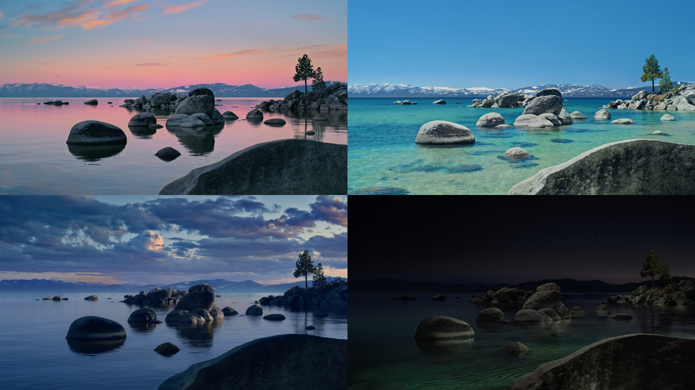

# Aerial Dynamic Wallpaper



A small toolchain for macOS Tahoe (26) and Golden Gate (27) that turns
Apple's separate aerial wallpapers of one place at different times of
day, or any four images you provide, into a single **solar-dynamic HEIC**
that macOS rotates natively based on the current sun position at your
location.

No cron job, no LaunchAgent, no background process. The system reads the
embedded `apple_desktop:solar` metadata and picks the right frame on its
own — and because the sun position is computed from Location Services,
the timing follows you when you travel.

Three Apple packs are defined out of the box: **Golden Gate** (Day,
Sunset, Evening, Night; macOS 27), **Tahoe** (Morning, Day, Evening,
Night) and **Sequoia** (Sunrise, Morning, Night). Packs live in
`scenes.json`, and `aerial-build-dynamic` accepts arbitrary images via
`--images` for fully custom wallpapers.

## Requirements

- macOS Tahoe (or newer) with Apple's aerial wallpapers available
  in System Settings → Wallpaper. The videos do not need to be
  downloaded.
- Xcode Command Line Tools (provides `swift`). Install with:
  ```sh
  xcode-select --install
  ```
  This is a ~1 GB download if you don't already have it.
- Location Services enabled for "Setting Time Zone" / "System Customization"
  (recommended, for travel-aware rotation):
  System Settings → Privacy & Security → Location Services → System Services.

## How it works

1. `aerial-extract-frames.swift` looks up the pack's clips in the live
   aerial manifest by the shot IDs listed in `scenes.json` and writes a
   poster PNG for each into `~/Pictures/AerialWallpapers/`. A clip that
   macOS has already cached under
   `~/Library/Application Support/com.apple.wallpaper/aerials/videos/`
   is read from there. Otherwise the single frame is read from the
   clip's URL in the manifest (Apple's `sylvan.apple.com`), which
   fetches a few megabytes instead of the 450-600 MB video.

2. `aerial-build-dynamic.swift` packs the PNGs into a single HEIC at
   `~/Pictures/AerialWallpapers/<Pack>-Dynamic.heic`. It attaches an
   `apple_desktop:solar` metadata block — a base64-encoded plist mapping
   each frame to sun (altitude, azimuth) anchors and light/dark
   appearance fallbacks. The anchors are generated from the pack's
   schedule in `scenes.json`.

3. `aerial-install` chains the two and then sets the HEIC as the desktop
   wallpaper via AppleScript. macOS handles the rotation from there.

## Install

```sh
git clone https://github.com/BiAksoy/aerial-dynamic-wallpaper.git
cd aerial-dynamic-wallpaper
bin/aerial-install
```

That's it. The installer prints what it's doing and which file it produced.
On success, your wallpaper is now the dynamic HEIC and macOS will rotate
through the frames as the sun moves.

Without `--pack`, the installer picks the newest pack in `scenes.json`
that your Mac's aerial manifest contains: Golden Gate on macOS 27, Tahoe
on macOS 26.

### First-run permission prompt

The first time `aerial-install` runs, macOS will ask the terminal for
permission to control "System Events" (this is how the wallpaper actually
gets set). Approve it. If you dismiss the prompt by accident, the
wallpaper won't change — re-grant access in:

> System Settings → Privacy & Security → Automation → \[your terminal] → System Events

The script also works across multiple displays (it sets the wallpaper on
every desktop, not just the primary one).

### Verifying the build

To confirm the generated HEIC carries the right metadata:

```sh
bin/aerial-inspect ~/Pictures/AerialWallpapers/GoldenGate-Dynamic.heic
```

It prints the frame count and dimensions, the light/dark appearance
mapping, and the full solar (altitude, azimuth → frame) table.

### Other aerial packs

```sh
bin/aerial-list                      # packs in scenes.json and their status
bin/aerial-install --pack Tahoe
bin/aerial-install --pack Sequoia
bin/aerial-install --pack "Golden Gate"
```

`--pack` takes any pack name from `scenes.json`. A pack is a list of
frames, each tied to an Apple aerial by its `shotID` in the manifest, and
a schedule (see [Tuning the rotation](#tuning-the-rotation)). To add one,
copy an entry and change the shot IDs; `bin/aerial-list --all` prints
every aerial on your Mac with its shot ID. A pack does not have to stay
within one place, and it can have any number of frames.

Sequoia has three clips and no evening one, so its Morning frame stays up
until sunset.

### Bring your own images

`aerial-build-dynamic` also works as a standalone HEIC builder for any
four images you supply — they don't have to come from an Apple aerial
pack:

```sh
bin/aerial-build-dynamic.swift \
    --images morning.png day.png evening.png night.png \
    --out my-wallpaper.heic
```

Then set it as your wallpaper through System Settings or:

```sh
osascript -e \
    'tell application "System Events" to tell every desktop to set picture to "'"$PWD/my-wallpaper.heic"'"'
```

For best results use four photos of the same scene at sunrise, midday,
sunset, and night. Same dimensions across all four.

## Re-running

Re-run `aerial-install` whenever you:

- Edit a schedule in `scenes.json` (e.g. to push evening earlier or
  extend morning)

## Tuning the rotation

Each pack in `scenes.json` has two schedules, written in the order the
frames appear, with the sun altitude (in degrees above the horizon) at
which one frame hands over to the next:

```json
{
  "name": "Golden Gate",
  "clips": {
    "day": "GG_A_DAY",
    "sunset": "GG_A_SUNSET",
    "evening": "GG_A_EVENING",
    "night": "GG_A_NIGHT"
  },
  "rising": ["night", -3, "day"],
  "setting": ["day", 10, "sunset", -1, "evening", -9, "night"],
  "light": "day",
  "dark": "night"
}
```

`rising` covers the first half of the solar day, while the sun climbs:
here Night stays until the sun is 3° below the horizon, then Day takes
over. `setting` covers the second half: Day until the sun has dropped to
10°, Sunset until it is 1° below the horizon, Evening until 9° below,
then Night. `light` and `dark` name the frames stored as the light and
dark appearance variants.

Useful reference altitudes: 0° is the horizon (sunrise and sunset), -6°
is the end of civil twilight (streetlights on), -12° is nautical
twilight (properly dark). To move a switch, change its number and re-run
`aerial-install`.

Because the schedule is written in sun altitudes, it holds at any
latitude and in either hemisphere: a switch at 10° happens whenever the
sun is at 10° where you are. `docs/solar-selection.md` records how macOS
picks a frame and how that was measured.

The `--images` mode uses a fixed four-frame schedule defined near the top
of `bin/aerial-build-dynamic.swift`.

## Uninstall

```sh
# Restore an Apple wallpaper from System Settings → Wallpaper.
# Then delete the generated files and the clone:
rm -rf ~/Pictures/AerialWallpapers
```

## Files

```
aerial-dynamic-wallpaper/
├── README.md
├── scenes.json                       # packs: frames, shot IDs, schedules
├── docs/
│   └── solar-selection.md            # how macOS picks a frame (measured)
└── bin/
    ├── aerial-list                   # packs, and every aerial's shot ID
    ├── aerial-extract-frames.swift   # aerial clip → poster PNG
    ├── aerial-build-dynamic.swift    # PNGs → solar HEIC
    ├── aerial-inspect                # decode + print HEIC metadata
    └── aerial-install                # extract → build → set wallpaper
```

## Reference

- Apple's solar HEIC format is the same one used by the original Mojave
  "Dynamic Desktop" wallpapers. Third-party generators like
  [`wallpapper`](https://github.com/mczachurski/wallpapper) and
  [`Equinox`](https://github.com/rlxone/Equinox) document the format in
  more detail; this project bakes a minimal version of it directly.
- Aerial asset UUIDs and shot IDs are read from
  `~/Library/Application Support/com.apple.wallpaper/aerials/manifest/entries.json`.
- The Sequoia mapping follows
  [rainhuang0220's fork](https://github.com/rainhuang0220/aerial-dynamic-wallpaper).
